# Design: run every Python app on the current pdt through a runner

Status: proposal for issue #146. This PR holds this document only. No code in `src/` changes.

Line numbers refer to `main` at `141d5d52`. Lines in pdt-examples refer to its `main` at `2260e80`. The prototype files and their output are on the author's computer only; the numbers are in [section 10](#10-prototype-and-measurements).

## Contents

1. [Summary and recommendation](#1-summary-and-recommendation)
2. [Is this a runner runtime that always wraps user scripts?](#2-is-this-a-runner-runtime-that-always-wraps-user-scripts)
3. [Before and after](#3-before-and-after)
4. [The design](#4-the-design)
5. [Runtime implications](#5-runtime-implications)
6. [Effect on every example app](#6-effect-on-every-example-app)
7. [Compatibility](#7-compatibility)
8. [Alternatives considered](#8-alternatives-considered)
9. [The order question: the runner and the `pdt.yml` rename](#9-the-order-question-the-runner-and-the-pdtyml-rename)
10. [Prototype and measurements](#10-prototype-and-measurements)
11. [Rollout](#11-rollout)
12. [Open questions](#12-open-questions)

## 1. Summary and recommendation

Today the `pdt-cli` pin in the script header of `run.py` decides which pdt a Python app runs on, in all three places where a job runs. `AGENTS.md:84` says that the pin "is not a decision to keep a job on an old pdt". The code does the opposite: the pin is the only input that selects pdt.

The proposal adds `src/pdt/run_python.py`. It does for `run.py` what `src/pdt/run_powershell.py` does for `.ps1` files. pdt starts the runner from its own installation. The runner loads the `pdt` package from that installation and runs `run.py` as `__main__` in the same Python process. uv installs the other dependencies of the `run.py` header next to pdt's own dependencies. The runner drops every `pdt-cli` entry of the header.

Recommendation:

- Accept the runner, in two phases. Phase 1 changes only where pdt and the packages come from. Phase 2, a separate decision, moves the setup that each `run.py` repeats into the runner.
- In an image, deploy copies the pdt package that runs the deploy into the build context and installs it with its dependencies before the app files. This also fixes issue #143 for PowerShell apps.
- Leave an app's own `Dockerfile` unchanged. Warn when it does not start the runner, because that app still runs its pinned pdt.
- Land phase 1 before migration 5 (the `config.yml` to `pdt.yml` rename). [Section 9](#9-the-order-question-the-runner-and-the-pdtyml-rename) gives what migration 5 must do in each order.

The prototype ran all 4 Python apps in pdt-examples and the 3 bundled Python examples through a sketch runner on the current source. Each app gave the same output and exit code as the app expects. With a warm uv cache, the median start time grew by 13 to 132 ms per run. A cached image rebuild after a `run.py` edit took 2 s instead of 18 s.

## 2. Is this a runner runtime that always wraps user scripts?

Yes, with exact limits.

**What "always" covers.** After phase 1, each Python app that pdt itself starts runs inside `run_python.py`. pdt starts an app in three places: `pdt run`, the Windows scheduled task, and the image that deploy generates for aws, azure, and google-cloud. A PowerShell app that has its own `run.py` (written by `pdt new APP --from-scripts`) also runs inside the runner, because that file is a Python app.

**What "wraps" means.** The runner is not a second process around `run.py`. It is the same Python process. The runner prepares the import of `pdt`, adds the app folder to `sys.path`, sets `sys.argv`, and calls `runpy.run_path(run.py, run_name="__main__")`. `run.py` then runs exactly as it runs under `python run.py`: its `if __name__ == "__main__":` block runs, `__file__` names `run.py`, and `sys.exit(N)` gives the exit code N.

**What "runtime" means.** The runner decides two parts of the run that the header of `run.py` decided before. The header still decides the other two parts:

| Item | Before | After |
|---|---|---|
| The pdt code | The `pdt-cli` pin, installed from PyPI | The pdt that starts the run |
| pdt's own dependencies | The dependencies of the pinned release | The dependencies of the pdt that starts the run |
| The other packages | The header | The header, unchanged |
| The Python version | The header's `requires-python` | The header's `requires-python`, unchanged |

**What the runner does not wrap.**

- A user who types `uv run run.py` or `./run.py`. uv reads the header, so the pin still applies ([section 7](#7-compatibility)).
- An app with its own `Dockerfile` whose `ENTRYPOINT` does not start the runner. `write_dockerfile` uses that file as is (`src/pdt/deploy_common.py:132-134`).
- A second script that the app starts as a separate process and that has its own header. An example is the refresh-token hook of `salesforce-netsuite-customer-sync`, which pins `pdt-cli[apps]==0.1.2` (`scripts/sf-refresh-token-keyvault.py:4`).
- A PowerShell app with no `run.py`. `run_powershell.py` already runs it on the current pdt.

**What phase 1 adds to a run.** Nothing. The runner loads no config, checks no env var, touches no storage, and writes no log line. The output of a run stays the same, with one exception: a traceback has 5 more frames at its top (2 for the runner and 3 for `runpy`).

## 3. Before and after

### 3.1 Before

```mermaid
flowchart TB
  subgraph LOCAL["pdt run on the user's computer"]
    A1["pdt process: uv tool install or clone<br/>cli.cmd_run: merged_app, load_env,<br/>missing_env, email check<br/>cli.py:185-197"]
    A2["uv run --script run.py<br/>cli.py:199"]
    A3["Python process, script environment<br/>pdt = the run.py pin, from PyPI<br/>run.py: merged_app, load_env, missing_env again<br/>storage: project/.pdt/storage/APP<br/>logs: the terminal"]
    A1 --> A2 --> A3
  end
  subgraph WIN["Windows scheduled task, SYSTEM account"]
    B1["uv run --script run_windows_task.py<br/>file of the pdt that ran deploy<br/>sets PDT_STORAGE_URL, run_windows_task.py:44"]
    B2["uv run --script run.py<br/>working folder: the live app folder<br/>run_windows_task.py:47-48"]
    B3["Python process, script environment<br/>pdt = the run.py pin, from PyPI<br/>run.py: merged_app, load_env, missing_env<br/>storage: ProgramData/pdt/APP/storage"]
    B4["log file ProgramData/pdt/APP/logs/UTC-start.log<br/>last line: pdt: exit N<br/>run_windows_task.py:51-59"]
    B1 --> B2 --> B3
    B1 --> B4
  end
  subgraph IMG["Image: aws, azure, google-cloud"]
    C0["deploy builds DOCKERFILE<br/>COPY app and pdt.yml<br/>RUN uv sync --script run.py<br/>pdt = the run.py pin, from PyPI<br/>deploy_common.py:67-74"]
    C1["sh -c ENTRYPOINT"]
    C2["uv run --script run.py"]
    C3["Python process<br/>run.py: merged_app from /workspace/pdt.yml,<br/>load_env expands PDT_ENV_JSON<br/>storage: PDT_STORAGE_URL from the job definition"]
    C4["provider log service<br/>sh prints pdt: exit N"]
    C0 -.-> C1 --> C2 --> C3
    C1 --> C4
  end
```



### 3.2 After phase 1

```mermaid
flowchart TB
  subgraph LOCAL["pdt run on the user's computer"]
    A1["pdt process: uv tool install or clone<br/>cli.cmd_run: unchanged checks<br/>writes the run requirements:<br/>header without pdt-cli + pdt's dependencies"]
    A2["uv run --with-requirements FILE<br/>--script PDT/run_python.py APP_DIR"]
    A3["Python process, one environment<br/>run_python.py loads pdt from the installed pdt<br/>runpy runs run.py as __main__<br/>run.py: merged_app, load_env, missing_env<br/>storage and logs: unchanged"]
    A1 --> A2 --> A3
  end
  subgraph WIN["Windows scheduled task, SYSTEM account"]
    B1["uv run --script run_windows_task.py<br/>file of the installed pdt<br/>sets PDT_STORAGE_URL"]
    B2["uv run --with-requirements FILE<br/>--script PDT/run_python.py APP_DIR"]
    B3["Python process, one environment<br/>pdt = the installed pdt at each run<br/>run.py: unchanged"]
    B4["log file and pdt: exit N: unchanged"]
    B1 --> B2 --> B3
    B1 --> B4
  end
  subgraph IMG["Image: aws, azure, google-cloud"]
    C0["deploy writes .pdt-runtime: the deploying pdt package<br/>and requirements.txt<br/>RUN uv pip install into /opt/pdt, before the app files<br/>COPY app and pdt.yml"]
    C1["sh -c ENTRYPOINT"]
    C2["/opt/pdt/bin/python -m pdt.run_python .<br/>no uv at run time"]
    C3["Python process<br/>pdt = the pdt that ran the last deploy<br/>run.py: unchanged"]
    C4["provider log service<br/>sh prints pdt: exit N: unchanged"]
    C0 -.-> C1 --> C2 --> C3
    C1 --> C4
  end
```



### 3.3 Where each item is set up

| Item | `pdt run` | Windows task | Image |
|---|---|---|---|
| Where pdt comes from, before | The `run.py` pin, from PyPI (`cli.py:199`) | The `run.py` pin, from PyPI (`run_windows_task.py:47-48`) | The `run.py` pin, from PyPI (`deploy_common.py:72`) |
| Where pdt comes from, after | The pdt that runs `pdt run` | The pdt installation that holds `run_windows_task.py` (`deploy_windows.py:78`), at each run | The pdt that ran the last `pdt deploy` |
| Config | `cmd_run` and `run.py` both call `merged_app` (`cli.py:185`) | `run.py` calls `merged_app` | `run.py` calls `merged_app`; `PDT_PROJECT=/workspace` (`deploy_common.py:71`) |
| Env | `cmd_run` loads `.env` (`cli.py:186`); `run.py` loads it again | `run.py` loads `.env` from the live folder | `run.py` expands `PDT_ENV_JSON` (`config.py:527-541`) |
| Storage | `<project>/.pdt/storage/<app>/` (`storage.py:58-63`) | `PDT_STORAGE_URL` from `run_windows_task.py:44` | `PDT_STORAGE_URL` from the job definition (`deploy_aws_batch.py:641`, `deploy_azure_container_apps.py:217`, `deploy_google_cloud.py:802`) |
| Logs | The terminal | `logs\<UTC start>.log` and `pdt: exit N` (`run_windows_task.py:43`, `59`) | The provider log service; `sh` prints `pdt: exit N` (`deploy_common.py:73`) |

Phase 1 changes only the first two rows. The config, env, storage, and log rows stay the same.

## 4. The design

### 4.1 Two parts

**Part 1, the command builder.** A function in `run_python.py` that needs only the standard library:

1. Read the PEP 723 block of `run.py` with the reference regular expression and `tomllib`.
2. Drop each `dependencies` entry whose name is `pdt-cli`. Remember its extras.
3. Add pdt's own dependencies. Add the `apps` extra when the dropped entry asked for it.
4. Write the result to a temporary requirements file.
5. Return the command `uv run --no-project --python <requires-python> --with-requirements <file> --script <pdt>/run_python.py <app dir> [args]`.

`cli.cmd_run` and `run_windows_task.py` call this function. `run_windows_task.py` reaches it through `sys.path`, as the provider scripts and `run_powershell.py` reach the package (`run_powershell.py:41`). Deploy calls it to write `requirements.txt` for the image.

**Part 2, the runner.** The `__main__` of `run_python.py`:

```python
def load_pdt(package: Path) -> None:
    """Import only the pdt package from `package`; every other package comes from this env."""
    spec = importlib.util.spec_from_file_location(
        "pdt", package / "__init__.py", submodule_search_locations=[str(package)])
    module = importlib.util.module_from_spec(spec)
    sys.modules["pdt"] = module
    spec.loader.exec_module(module)


def main() -> None:
    app_dir, *rest = sys.argv[1:]
    load_pdt(Path(__file__).resolve().parent)
    run_py = Path(app_dir).resolve() / "run.py"
    sys.path.insert(0, str(run_py.parent))
    sys.argv = [str(run_py), *rest]
    runpy.run_path(str(run_py), run_name="__main__")
```

The runner does not catch any exception. `SystemExit`, `KeyboardInterrupt`, and every other exception leave the process exactly as they leave `python run.py`.

### 4.2 Why the runner loads only the `pdt` package

`run_powershell.py:41` and the provider scripts put the parent folder of the package at the front of `sys.path`. In an installed pdt, that folder is the `site-packages` folder of the uv tool environment. It holds every package of that environment, built for that environment's Python. If the runner did the same, the tool's `rich`, `cryptography`, or `pyyaml` would shadow the versions that the app's header asks for. A tool environment on Python 3.13 would also give compiled modules that a Python 3.12 run cannot load.

The sketch above imports the `pdt` package only, from its own folder. Every other package comes from the run's environment. The prototype confirmed it: `pdt.__file__` pointed at the source folder, and `yaml.__file__` pointed at the uv cache.

### 4.3 Where pdt's dependency list comes from

The command builder must know pdt's dependencies in three places: in `pdt run`, in the Windows task, and at deploy. Two choices exist:

- Constants in `run_python.py`, with a test that compares them with `pyproject.toml` (`pyproject.toml:8-35`). Issue #146 proposes this. It works the same way everywhere, also in a clone.
- `importlib.metadata.requires("pdt-cli")`. It needs the package metadata, which a `uv tool install` has and a provider script started from a clone does not have.

The proposal takes the constants. Open question 7 asks the user to confirm.

### 4.4 Each place

**`pdt run`.** `cmd_run` keeps its checks (`cli.py:185-197`). It replaces `["uv", "run", "--script", "run.py"]` (`cli.py:199`) with the command from part 1. It passes `PDT_CLI_VERSION`, because the runner's environment has no `pdt-cli` metadata and `pdt.__version__` otherwise falls back to `0.0.0.dev0` (`src/pdt/__init__.py:4-9`). `deploy.provider_env` already passes this variable to provider scripts (`deploy.py:81`).

**Windows task.** `run_windows_task.py` replaces the command at lines 47-48 with the command from part 1. The task action does not change (`deploy_windows.py:214-219`), so no redeploy is necessary. The first run after a pdt upgrade uses the new pdt.

**Image.** Deploy writes a folder `.pdt-runtime/` into the build context with the pdt package and `requirements.txt`. A sketch of the generated file:

```dockerfile
FROM ghcr.io/astral-sh/uv:python3.12-bookworm-slim
ENV PDT_PROJECT=/workspace NO_COLOR=1 DBT_USE_COLORS=false PDT_CLI_VERSION={version}
COPY .pdt-runtime/requirements.txt /opt/pdt-runtime/requirements.txt
RUN uv venv /opt/pdt && uv pip install --python /opt/pdt -r /opt/pdt-runtime/requirements.txt
COPY .pdt-runtime/pdt /opt/pdt-runtime/pdt
COPY pdt.yml /workspace/pdt.yml
COPY {app} /workspace/{app}
WORKDIR /workspace/{app}
ENTRYPOINT ["sh", "-c", "/opt/pdt/bin/python /opt/pdt-runtime/pdt/run_python.py .; code=$?; echo \"pdt: exit $code\"; exit $code"]
```

The dependencies install before the app files, so an edit to the app code does not invalidate that layer. `POWERSHELL_DOCKERFILE` (`deploy_common.py:75-84`) installs `pdt-cli[apps]=={version}` from PyPI today. It can take the same two `.pdt-runtime` lines, and the two templates can become one template with optional pwsh lines.

Copying the package into the context changes the rule in `AGENTS.md:81`: "Never copy package source into a build context." The open PR #132 adds one exception for the same reason (`.pdt-runtime/pdt`, for the failure notice). Open question 1 asks the user to decide.

### 4.5 Phase 2, a later and separate decision

`run_powershell.py:66-73` loads config and env and checks env before it runs the scripts. The Python runner can do the same. Then a scaffolded `run.py` needs no setup code. [Section 7](#7-compatibility) shows that an existing `run.py` that keeps its own setup still works. Phase 2 can also give each app `PDT_OUTPUT_DIR` (`run_powershell.py:81-100`), the managed state folder of issue #121, and the failure notice of PR #132. Phase 1 does not depend on phase 2.

## 5. Runtime implications

### 5.1 Builds

| Aspect | Before | After |
|---|---|---|
| Dockerfile | `COPY . /workspace`, then `uv sync --script run.py` (`deploy_common.py:69-72`) | `COPY .pdt-runtime/requirements.txt`, install, then `COPY` the app |
| Layers | The dependency layer comes after `COPY .`, so each file change rebuilds it | The dependency layer comes before the app files |
| Image size, `hello-world` | 76 MB | 77 MB |
| Image size, `impossible-travel-report` | 113 MB | 113 MB |
| Build time with no cache, `hello-world` | 9 s | 7 s |
| Build time with no cache, `impossible-travel-report` | 31 s | 30 s |
| Rebuild after a `run.py` edit, with layer cache | 18 s | 2 s |

The sizes are the `Size` values of `docker image inspect` on an arm64 computer. The base image has 67 MB. The rebuild gain applies where the builder keeps layers: `docker build` on aws (`deploy_aws_batch.py:501`) and on azure in GitHub Actions (`deploy_azure_container_apps.py:76`). `az acr build` (`deploy_azure_container_apps.py:80`) and `gcloud builds submit` (`deploy_google_cloud.py:479`) get no cache option from pdt today, so they build each layer every time, before and after.

The build context grows by the pdt package: 880 KB on disk, with `__pycache__`.

### 5.2 Runtime

**Process tree.**

| Place | Before | After |
|---|---|---|
| `pdt run` | pdt, then uv, then Python with `run.py` | pdt, then uv, then Python with the runner and `run.py` |
| Windows task | uv, then Python with `run_windows_task.py`, then uv, then Python with `run.py` | The same depth; the last process runs the runner and `run.py` |
| Image | `sh`, then uv, then Python with `run.py` | `sh`, then Python with the runner and `run.py`; no uv |

**Python interpreter.** The runner passes the header's `requires-python` to `uv run --python`. In the image, the base image has Python 3.12. A header that asks for a later Python needs `uv venv --python` with that version at build time.

**Dependency resolution.** Before, uv resolved `pdt-cli==<pin>` plus the other entries. After, uv resolves pdt's own dependencies plus the other entries. A conflict between the app's header and pdt's dependencies now fails the resolution with uv's message. Before, the pinned pdt's dependencies could conflict in the same way.

**Start time, warm uv cache.** [Section 10](#10-prototype-and-measurements) has the numbers. In short: `uv run --with-requirements` adds 13 to 132 ms on the median. The image starts the runner with the venv's Python and no uv. That form took 114 ms for `hello-world` and 151 ms for `impossible-travel-report`, which is in the range of the pinned `uv run`.

**uv cache.** `uv run --with-requirements` builds a temporary environment for each run under `~/.cache/uv/builds-v0/`, from packages in the uv cache. The prototype showed `sys.executable` in a new `.tmp` folder at each run. The cache itself grows by the same packages as before. A cold cache took 1.9 s for `hello-world` and 5.8 s for `impossible-travel-report`, the same as the pinned run (2.0 s and 5.6 s).

**Offline.** With a warm cache and `UV_OFFLINE=1`, the runner command and the pinned command both ran. An image with `--network none` printed the same output before and after. The image needs no network at start, because it does not call uv at run time.

### 5.3 Logging

- `pdt.utils.log.log` and `die` write to the stdout of the process (`utils/log.py:24-48`). The runner and `run.py` share that process, so each line looks the same. The JSON form on Cloud Run (`log.py:26-27`) does not change.
- `print` and stderr go to the same streams as before.
- The `pdt: exit N` line comes from `sh` in the image (`deploy_common.py:73`) and from `run_windows_task.py:59`. Neither changes. `pdt runs` reads that line (`runs_cli.py:42`, `112-114`), so it also does not change.
- A traceback gets 5 more frames: the runner's module and `main` frames and 3 `runpy` frames. Open question 9 asks whether the runner should hide them.

### 5.4 Storage and state

- `storage.root()` names the folder from `PDT_STORAGE_URL`, or from `config.running_app_dir()` (`storage.py:58-63`). `running_app_dir` reads `__main__.__file__` (`config.py:509-514`). `runpy.run_path` sets `sys.modules["__main__"]` to a module whose `__file__` is `run.py` while `run.py` runs. The prototype printed the correct app folder.
- The runner must not call `storage.root()` after `run_path` returns, because `__main__` is the runner again then. Phase 2 code must pass the app folder explicitly.
- The `state/` lock: `pull` takes it and only `push` with the lease releases it (`storage.py:313-339`). A failed run leaves it for 30 minutes (`storage.py:38`). PR #64 adds `abort` and `storage.sync()`. Phase 1 does not change the lock. Because the runner and `run.py` share one process, a later change can release the lock of each open lease when `run.py` ends with an error, for every app and without a change to `run.py`. That needs PR #64's `abort`.
- The runner must never take the `state/` lock for an app that pulls `state/` itself. `_take_lock` does not check the run id (`storage.py:341-352`), so the app's own `pull` would then fail with `StorageLocked`. A managed state folder (issue #121) must stay opt-in.
- `PDT_OUTPUT_DIR` exists only for PowerShell apps (`run_powershell.py:81-100`). Phase 1 does not add it for Python apps.

### 5.5 Env and secrets

Phase 1 does not change env handling. `cmd_run` loads `.env` before it starts the child (`cli.py:186`), and the child gets the parent's environment. In the image, `PDT_ENV_JSON` and `PDT_ENV_SECRET_RESOURCE` come from the job definition (`deploy_aws_batch.py:395`, `637`; `deploy_azure_container_apps.py:214-215`; `deploy_google_cloud.py:797-800`), and `run.py` expands them with `load_env`. The runner adds `PDT_CLI_VERSION`. The runner reads no secret.

### 5.6 Exit codes

| Event in `run.py` | Exit code before | Exit code after |
|---|---|---|
| `sys.exit(7)` or `return 7` from `main` with `sys.exit(main())` | 7 | 7 (measured) |
| `die(1, ...)` | 1 | 1 (measured) |
| An uncaught exception | 1 | 1 (measured) |
| Normal end with no `sys.exit` | 0 | 0 (measured) |

The runner adds its own failures only before `run.py` starts: an unreadable header, or a uv resolution failure. These exit non-zero in the same way that a uv failure exits today.

### 5.7 Ctrl-C and signals

The prototype sent SIGINT to the process group of a parent that starts the command the way `cmd_run` does (`subprocess.run`). Before and after, `run.py` got `KeyboardInterrupt`, its `except` block ran, and the parent exited 130. The runner adds no process, so the signal path is the same. `subprocess.run` in `cmd_run` kills the child shortly after the parent gets `KeyboardInterrupt`. That is true before and after.

In the image, the container runtime sends SIGTERM to `sh`, which is PID 1. That is true before and after. The image removes one process (uv), so Python is one level closer to PID 1.

### 5.8 Failure email (PR #132)

PR #132 sends a notice after a non-zero exit. The image runs `notify.py` from a copy of the deploying pdt in `.pdt-runtime/pdt`, because the app's pinned pdt can be old or can lack `notify`. The Windows task installs the notice's packages into a separate uv cache. With the runner, the image already holds the deploying pdt in `/opt/pdt`, and the task already runs the installed pdt. So:

- The notice can run as `/opt/pdt/bin/python -m pdt.notify ...` from `sh`, with no second copy of pdt and no uv at run time.
- The Windows task can run the notice with the same requirements as the run, with no separate cache.
- The notice must stay outside the app process, in `sh` or in `run_windows_task.py`. A notice inside the runner does not run when the process is killed, for example at the time limit or for lack of memory.

### 5.9 Windows tasks

- The task action names `run_windows_task.py` of the pdt that ran deploy (`deploy_windows.py:78`, `214-219`). `uv tool upgrade pdt-cli` replaces the files at the same path, so the next run uses the new pdt with no redeploy. That is the intent of the rule in `AGENTS.md:84` (PR #147).
- The task runs as SYSTEM with SYSTEM's uv cache. The first run after a pdt upgrade resolves the new requirements and needs network, as the first run after a pin change does today.
- If the user removes the pdt installation, the task fails. That is true today, because `run_windows_task.py` lives in that installation.

### 5.10 A dev or clone build of pdt (issue #143)

- `pdt run` and the Windows task from a clone run the clone's source, because the runner loads the package from its own folder. Today they run the pinned PyPI release. A clone's `__version__` comes from `pyproject.toml` (`0.1.6`), so a scaffold from a clone pins `0.1.6` and a run uses PyPI 0.1.6, not the clone's changes.
- The image gets the deploying pdt's package files, so a clone deploy ships the clone's code. This fixes issue #143 for Python and PowerShell apps in the same change.
- The verify workflow no longer needs the wheel copy and the `[tool.uv.sources]` line that `verify/scripts/sync_apps.py:29-37` writes, because deploy ships the installed pdt. The runner drops the `pdt-cli` entry and ignores that source.

### 5.11 A new risk: the pdt API that apps import

Today an app keeps the pdt it was written against until someone raises the pin. After the runner, each app runs on the current pdt at the next `pdt run`, at the next Windows run, and at the next deploy. A pdt change that removes or changes a name that apps import breaks those apps at once. `AGENTS.md:49` already calls `src/pdt/utils/` public API. Apps also import these names outside `utils`:

- `pdt.config`: `ConfigError`, `merged_app`, `load_env`, `check_env`, `missing_env` (every example).
- `pdt.run_powershell.pwsh_command`, `pdt.pwsh.ensure_pwsh`, `pdt.powershell.extract` and `split_files` (the `run.py` that `pdt new --from-scripts` writes, `scaffold.py:90-153`).

The prototype showed the opposite risk of the pin: the bundled `impossible-travel-report/run.py` imports `missing_env`, which exists only from 0.1.6. With a `0.1.4` pin, the image failed with `ImportError`. Under the runner, the risk moves to old apps on a new pdt. The rule in `AGENTS.md:49` must cover these names, and a test must import each name that the bundled examples and the `--from-scripts` template import.

## 6. Effect on every example app

Sources: `src/pdt/examples/` on `main`, and pdt-examples `main`. The table also has the generated `verify/` apps and one private customer app that the user described.

| App | `run.py` header | Own Dockerfile | Imports from pdt | Storage and env | What changes |
|---|---|---|---|---|---|
| `hello-world` (bundled) | `pdt-cli==PDT_VERSION`; the scaffold writes the running version (`scaffold.py:331`) | No | `pdt.config`: `ConfigError`, `load_env`, `merged_app`, `missing_env`; `pdt.utils.log`: `die`, `log` | No storage; no env vars | Works. The pin becomes inert. Phase 2 makes lines 26-34 redundant. |
| `impossible-travel-report` (bundled) | `pdt-cli[apps]==PDT_VERSION` | No | `pdt.config` as above; `pdt.utils.entra`: `graph_pages`, `graph_token`; `log`; `pdt.utils.send_email`: `pick_transport`, `send_email` | No storage; Azure credentials and email env vars (`config.yml`) | Works. The runner adds the `apps` extra. Prototype: exit 1 at the env check, as the app expects with no `.env`. |
| `monday-orphaned-account-report` (bundled) | `pdt-cli[apps]==PDT_VERSION` | No | As above, plus `pdt.utils.web.http_json` | No storage; reads `PDT_MONDAY_API_TOKEN` with `os.environ.get` (`run.py:292`) | Works. Same as above. |
| `powershell-report` (bundled) | No `run.py` | No | None | Optional `REPORT_GREETING` | Nothing. `run_powershell.py` runs it today. |
| `hello-world` (pdt-examples) | `pdt-cli==0.1.2` (`run.py:4`) | No | `pdt.config`: `ConfigError`, `check_env`, `load_env`, `merged_app` (`run.py:18`); `log` | No storage; no env vars | Works on the current pdt (prototype: exit 0, same line). The pin becomes inert. |
| `monday-orphaned-account-report` (pdt-examples) | `pdt-cli[apps]==0.1.2` (`run.py:4`) | No | `pdt.config` with `check_env` (`run.py:40`); `entra`; `log`; `send_email`; `web` | No storage; Azure and Monday env vars | Works (prototype: exit 1 at the env check, as expected with no `.env`). |
| `salesforce-netsuite-customer-sync` (pdt-examples) | `pdt-cli[apps]==0.1.2`, `meltano==4.2.2` (`run.py:4`) | Yes. `ENTRYPOINT ["uv", "run", "--script", "run.py"]`, with no `pdt: exit` line (`Dockerfile:10`) | `pdt.config` with `check_env` (`run.py:33`); `log`; `pdt.utils.storage` (`run.py:89`) | Pulls `state/` with a lease and pushes it after a failure too (`run.py:101-132`); keeps a folder per run under `.pdt/runs/` that it never deletes (issue #121); starts `meltano` from the folder of `sys.executable` (`run.py:41`); a hook script with its own pin `0.1.2` | `pdt run` and the Windows task: works on the current pdt; the prototype found `meltano` 4.2.2 next to the runner's Python. Image: no change, because the app's own Dockerfile runs `uv run --script run.py` with the 0.1.2 pin. The image gets the runner only after a Dockerfile change. The hook keeps its pin in every place. |
| `salesforce-netsuite-quote-to-cash` (pdt-examples) | `pdt-cli[apps]==0.1.0`, `meltano==4.2.2` (`run.py:4`) | No | `pdt.config` with `check_env` (`run.py:45`); `log` | No storage; `enabled: false` (`config.yml:2`) | `pdt run` works on the current pdt (prototype: exit 1 at the env check). The next deploy moves the image from 0.1.0 to the current pdt. No change to the app. |
| `verify/` apps (generated) | `pdt-cli` with no version (`verify/scripts/templates/run.py.txt:4`); CI adds a `[tool.uv.sources]` path to the commit's wheel | No | `pdt.config`: `ConfigError`, `load_env`, `merged_app`, `missing_env`; `log` | `PDT_SMOKE_TOKEN` | Works. The wheel copy in `sync_apps.py --wheel` becomes unnecessary; removing it is a cleanup, not a requirement. |
| A customer Meltano app (private) | `pdt-cli[apps]==0.1.3`, `meltano==4.2.2`; provider aws, hourly | Yes. Installs git and openssh-client, runs `uv sync --script run.py`, then `RUN --mount=type=ssh uv run --script run.py --install-only` (4 Meltano plugins from `git+ssh`); its `ENTRYPOINT` prints `pdt: exit N` | `pdt.config`: `check_env`, `load_env`, `merged_app`; `with storage.sync() as run` | `state/` through `storage.sync()`; Meltano as a subprocess | See below. Needs a Dockerfile change to get the runner in the image, and PR #64 to run at all. |

**The customer Meltano app in detail.**

- `storage.sync()` does not exist on `main` or in any tag from `v0.1.0` to `v0.1.6`. Only the open PR #64 adds it. So the run fails at that line with `AttributeError`, with or without the runner. The runner does not change this.
- After PR #64 merges and ships, `pdt run` and a Windows task get `storage.sync()` with no change to the app. With the pin alone, the app also needs a pin raise to that release.
- The image does not change, because `write_dockerfile` uses the app's own Dockerfile as is (`deploy_common.py:132-134`). It keeps pdt 0.1.3 until someone changes the Dockerfile or raises the pin.
- To use the runner, the Dockerfile replaces `RUN uv sync --script run.py` and `RUN ... uv run --script run.py --install-only` with the two `.pdt-runtime` lines and `RUN --mount=type=ssh /opt/pdt/bin/python /opt/pdt-runtime/pdt/run_python.py . --install-only`. Its `ENTRYPOINT` starts the runner in the same way. The runner passes `--install-only` to `run.py` (the prototype showed `sys.argv` with the argument).
- `meltano` runs as a subprocess from the folder of `sys.executable`. In the image with the runner, that folder is `/opt/pdt/bin`, where `uv pip install` puts the `meltano` command. The prototype confirmed this lookup for the local runner.
- The `ENTRYPOINT` already prints `pdt: exit N`, so `pdt runs` and `pdt logs` keep working. The `git+ssh` plugin installs do not depend on the runner.

**pdt-examples CI.** Its CI file checks that each `run.py` pins the version of the pdt under test (line 48), runs `uv run run.py` (line 49), and runs `pdt run` (line 50). With the runner, line 50 tests the pdt under test whatever the pin says. Line 49 still uses the pin, so the check on line 48 still matters for that line.

## 7. Compatibility

**An existing `run.py` with its own setup code.** Phase 1 runs it unchanged. In phase 2, the runner calls the same functions before `run.py`, and `run.py` calls them again. Each call is safe to repeat:

- `merged_app` reads files and returns a new dict (`config.py:225-261`).
- `load_env` calls `load_dotenv(override=False)` and `os.environ.setdefault` (`config.py:517-541`), so a second call changes nothing.
- `missing_env` and `check_env` only read (`config.py:571-637`).
- `storage.pull("state/", ...)` is the exception. The runner must not pull `state/` for the app ([section 5.4](#54-storage-and-state)).

**An app with its own Dockerfile.** Deploy uses the file as is. The image runs whatever the file says, so an app whose file runs `uv run --script run.py` keeps its pinned pdt. The proposal adds `.pdt-runtime/` to every build context, so the file can start the runner, and a `validate` and `deploy` note says when the file does not start it. Open question 2 asks the user whether a note is enough.

**A user who runs `uv run run.py` directly.** uv reads the header and installs the pinned pdt from PyPI. That run uses another pdt than `pdt run`. This is the one place where the pin still decides. The `pdt-cli` entry must stay in the header for this case and for editors that read the header. Open question 3 asks which form the scaffold writes.

**A PowerShell app.** No change. `run_powershell.py` already runs on the current pdt. An app with `run.py` and `requirements.psd1` runs its `run.py` through the runner.

## 8. Alternatives considered

| Alternative | How it works | Decision and reason |
|---|---|---|
| 1. Keep the pin; a migration raises it | Each release that changes the project shape adds a migration that rewrites the `pdt-cli` entry of each `run.py` | Not chosen. The migration must parse each pin form (`==`, `>=`, no version, extras, a `[tool.uv.sources]` path) and also pins in other scripts, such as the hook. A dev build has no PyPI version to pin. A user who does not run a pdt command keeps the old pin. The rule in `AGENTS.md:84` (PR #147) says that the pin is not a decision to keep a job on an old pdt. |
| 2. `uv run --with pdt-cli==<version> --script run.py` | uv puts the `--with` packages in a layer above the script environment | Not chosen. The prototype showed that it works for a PyPI release: `pdt.__version__` was 0.1.6 over a 0.1.3 pin. But uv still builds the base environment with the pinned pdt, so the old pin must still resolve, and two pdt copies are present. An installed pdt has no wheel or folder to pass, so a dev build cannot use it (issue #143). A clone folder passed with `--with` is built once and cached: the prototype edited `src/pdt/__init__.py`, and the next run did not see the edit. |
| 3. `pdt-cli` with no version in the header | uv installs the newest release from PyPI | Not chosen. The newest PyPI release is not the installed pdt. A dev build is not on PyPI. An image gets whatever release is newest at build time. |
| 4. The runner (this proposal) | pdt starts `run_python.py`, which loads pdt from the pdt that starts it | Chosen. The same pdt runs in `pdt run`, the Windows task, and the image. No migration raises a pin. A clone and a dev build work. Python apps and PowerShell apps get the same rule. |

## 9. The order question: the runner and the `pdt.yml` rename

PR #81 renames an app's `config.yml` to `pdt.yml`. PR #148 adds the migration framework and leaves migration 5, the rename, until #146 lands. The user is not sold on #146 coming first. This section states what migration 5 must do in each order. It does not assume one order.

**What an old pdt does with a renamed app.** The prototype renamed `config.yml` to `pdt.yml` in `hello-world` and changed its greeting. Then it ran the app with its `pdt-cli==0.1.2` pin:

| Shape | Result |
|---|---|
| Windows task shape: the working folder is the app folder, no `PDT_PROJECT` | Exit 1: `no app named 'hello-world'`. The old `find_project` stops at the app folder, because it now holds `pdt.yml` (`config.py:121-136`). |
| Image shape: `PDT_PROJECT=/workspace` | Exit 0 with the default greeting. The old `merged_app` reads `config.yml`, which is missing, and `load_yaml` returns `{}` for a missing file (`config.py:94-96`). The app runs with no config and no env spec, and nothing reports it. |

**Migration 5 without the runner.** For each app, in one step:

1. Rename `config.yml` to `pdt.yml`.
2. Raise the `pdt-cli` entry of `run.py` to the release that reads `pdt.yml`, or later. The step must handle each pin form, or block with a message for a form it does not know.
3. Do the same for each other script in the app that pins `pdt-cli` and reads config.
4. Block when that release is not on PyPI, because the Windows task and the next image build install it from PyPI. This blocks a dev build.
5. Print `pdt deploy <app>` for each cloud app. The deploy ships the renamed file and the raised pin together.

The rename and the raise must be one step, because a Windows task runs the live folder with the pinned pdt (`run_windows_task.py:47-48`). A rename with no raise gives the first row of the table above at the next scheduled run. A cloud app that deploys after a rename with no raise gives the second row: a silent run with no config.

**Migration 5 with the runner (phase 1 in a release at or before the rename release).**

1. Rename `config.yml` to `pdt.yml`. Do not touch `run.py`.
2. Print `pdt deploy <app>` for each cloud app. The image keeps the old files and the old pdt until that deploy, and the deploy ships both together.
3. For an app with its own Dockerfile that does not start the runner, the pin still decides. Migration 5 must either raise that app's pin, as in the list above, or block with a message.

The Windows task runs the installed pdt, which is the pdt that ran the migration, so it reads `pdt.yml` at the next run.

**Comparison.**

| Point | Runner first | Rename first, with pin raises |
|---|---|---|
| Code in migration 5 | A file rename, plus one rule for apps with their own Dockerfile | A file rename, a pin parser for each form, and a PyPI check |
| A dev build or clone | Works | Blocked, because the pin needs a PyPI release |
| `uv run run.py` by hand in the app folder after the migration | Uses the old pin and fails with `no app named`, unless the user raises the pin | Uses the raised pin and works |
| Later releases that change the project shape | Need no pin logic | Each needs the same pin raise |
| Risk | A new runtime path for every Python app (sections 5.2 and 5.11) | No new runtime path |

The pin-raise path is smaller if the runner is not accepted. If the runner is accepted, the pin logic in migration 5 is code that the runner makes unnecessary one release later. This document recommends the runner first. The user decides (open question 6).

## 10. Prototype and measurements

The prototype lives in the author's debug folder, not in this PR. It had three files: a command builder that reads the header with `tomllib` and drops `pdt-cli`, the runner from [section 4.1](#41-two-parts), and a timing script. It used the source of `main` at `141d5d52` as the current pdt. Computer: Apple silicon Mac, macOS, uv 0.12.10, Docker 29.7.2.

**Functional results.**

| Check | Result |
|---|---|
| All 4 Python apps in pdt-examples, through the runner | Same output and exit code as each app expects with no `.env` file: `hello-world` exit 0; the other 3 exit 1 at their env check |
| The 3 bundled Python examples with a `0.1.4` pin, through the runner | `hello-world` exit 0; `impossible-travel-report` and `monday-orphaned-account-report` exit 1 at their env check |
| `pdt.__file__` and `yaml.__file__` in the runner | The worktree source, and the uv cache |
| `pdt.__version__` in the runner | `0.0.0.dev0` without `PDT_CLI_VERSION`, so the command builder must pass it |
| `import helper` of a file next to `run.py` | Works, because the runner puts the app folder first on `sys.path` |
| `sys.argv` | `[<path>/run.py, --install-only]` |
| `meltano` lookup from the folder of `sys.executable` | Found `meltano` 4.2.2 in the runner environment |
| Exit codes | `return 7` gave 7; an exception gave 1 with a traceback; `die(1)` gave 1 |
| SIGINT to the process group | Before and after: `run.py` got `KeyboardInterrupt`, ran its `except` block, and the parent exited 130 |

**Start time with a warm uv cache.** Median of each round: 20 runs in round 1, 40 runs in rounds 2 and 3. The same computer ran other work, so the values vary by up to 100 ms between rounds. The image-shape column is one round of 20 runs.

| App | Before: `uv run --script run.py` (pinned), rounds 1, 2, 3 | After: `uv run --with-requirements ... run_python.py`, rounds 1, 2, 3 | Image shape: venv Python, no uv |
|---|---|---|---|
| `hello-world` (pdt-examples, pin 0.1.2) | 93, 121, 135 ms | 145, 226, 148 ms | 114 ms |
| `impossible-travel-report` (bundled, pin 0.1.4) | 179, 181, 121 ms | 311, 215, 236 ms | 151 ms |

The difference per round was 13 to 132 ms.

A variant wrote a copy of the runner with the requirements in its own header, so uv kept the environment in `environments-v2`. Its medians were 120 to 232 ms. It is not faster enough to justify a generated file. The floor for `uv run --no-project python -c pass` was 46 ms.

**Start time with an empty uv cache.** `hello-world`: 2.0 s before, 1.9 s after. `impossible-travel-report`: 5.6 s before, 5.8 s after. The cache held 57 MB and 250 MB afterwards.

**Offline.** With `UV_OFFLINE=1` and a warm cache, both commands ran. An image run with `--network none` printed the same line before and after.

**Images.** See the table in [section 5.1](#51-builds). Each image printed `pdt: exit N` as its last line. The pinned image of the bundled `impossible-travel-report` with a `0.1.4` pin failed with `ImportError: cannot import name 'missing_env'`, because that example needs 0.1.6 ([section 5.11](#511-a-new-risk-the-pdt-api-that-apps-import)).

## 11. Rollout

1. Phase 1 in one PR: `run_python.py` with the command builder and the runner; `cmd_run` and `run_windows_task.py` start it; the generated Dockerfile installs `.pdt-runtime`; tests for header parsing, the dependency constants against `pyproject.toml`, the runner's exit codes, and an import test for each name that the examples import. Update `AGENTS.md:49`, `AGENTS.md:81`, `AGENTS.md:84`, `README.md:222-232`, `README.md:317`, and the scaffolded `AGENTS.md` text (`scaffold.py:80`). The change to `scaffold.py:80` also changes the text that migration 4c of PR #148 compares.
2. Migration 5 (PR #81 in PR #148) after phase 1 ships, with the rule for apps with their own Dockerfile.
3. PR #132 moves its notice onto the runner's pdt ([section 5.8](#58-failure-email-pr-132)).
4. Phase 2 as a separate issue, if the user wants it.

## 12. Open questions

1. Should the image get the deploying pdt as copied package files in `.pdt-runtime/` for every deploy? The other choice is `pdt-cli[apps]==<version>` from PyPI for a release, and a copy only for a dev build. The first choice is one path, but it changes the rule in `AGENTS.md:81`.
2. For an app with its own Dockerfile that does not start the runner, is a note in `validate` and `deploy` enough? The other choices are a block, or a migration that rewrites the known generated lines, as migration 3 in PR #148 does for the old `ENTRYPOINT`.
3. Which form should the scaffold write in the header: `pdt-cli[apps]==<version>` as today, `pdt-cli[apps]>=<version>`, or `pdt-cli[apps]` with no version? The runner ignores all three. The form decides only what `uv run run.py` by hand installs.
4. Should the runner add the `apps` extra only when the header asks for it, or always? Always is one rule. It makes the `hello-world` environment grow from about 57 MB to about 250 MB in the uv cache, and the image from 77 MB to 113 MB.
5. Should phase 2 happen: the runner loads config and env, checks env, gives `PDT_OUTPUT_DIR`, and releases a `state/` lease after a failure? If yes, as a separate issue after phase 1?
6. Which order: the runner before migration 5, or migration 5 first with the pin raises of [section 9](#9-the-order-question-the-runner-and-the-pdtyml-rename)?
7. Should pdt's dependency list in the runner be constants with a test against `pyproject.toml`, or `importlib.metadata`?
8. A header can hold a `[tool.uv]` table (an index, sources, `exclude-newer`). `--with-requirements` does not carry it. Should the runner pass the table on, or print a warning? No example uses it today, except the `verify/` source line for `pdt-cli`, which the runner drops.
9. Should the runner remove its own 5 frames from a traceback?
